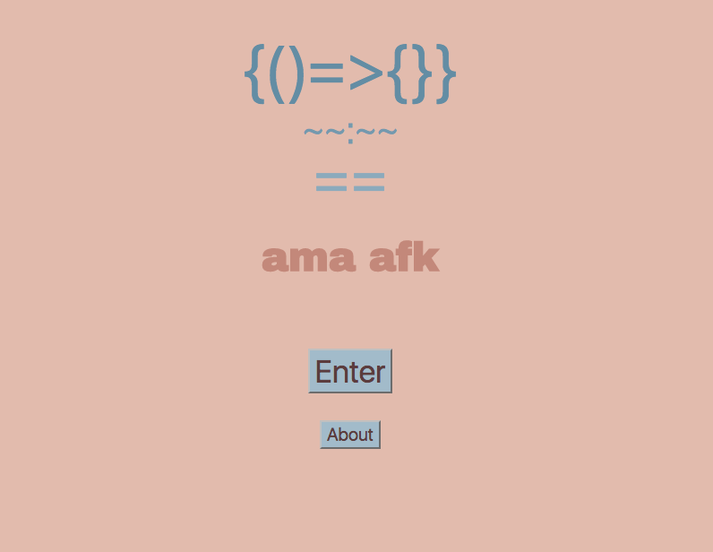

 # Code Quiz App

 # Front-End

This document provides general information on the code-quiz app cliend side application. For more information about back end side, please see https://github.com/giri68/code-quiz-app

### Why Code Quiz

This app focusses on quiz about spftware programming code. It has diferent section for different quiz category. User can login and make his own profile, by selectig the quiz by category. User can go to particular quiz and start question. User can complete the quiz at once or he can come again and start from the last question.

### When can I use it?

When you want to test your knowledge in software programmin using quiz, this app will be perfect for you. It is mobile first design, so you can use it anywhere, either in resturant or during travel. You do not need to complete the test in a single time, but you can come again and start from the last point.

### Where can I test it?
Test our app in the below link
https://code-quiz-client.herokuapp.com

## Technologies

### Front-End

The app uses React with reusable components. Redux handles the state of the apps that
is passed to each component.

### Back-End

The app is connected to a database on mLab. The back end uses node.js with express framework.

### How to use the app

#### login the app

When user loads up the app, he can see about the game by clicking about. To use the quiz app or to create 
his profile, he must login the app. If he has not username, he can create his username and password, then he can login the game. After login, he can go directly to the quiz menu page and can select the quiz to his profile. He can select one of the 
quiz and can go to question section in his dashboard. He can skip question, can choose answer. At last he can see his score out of total question he attempts.

